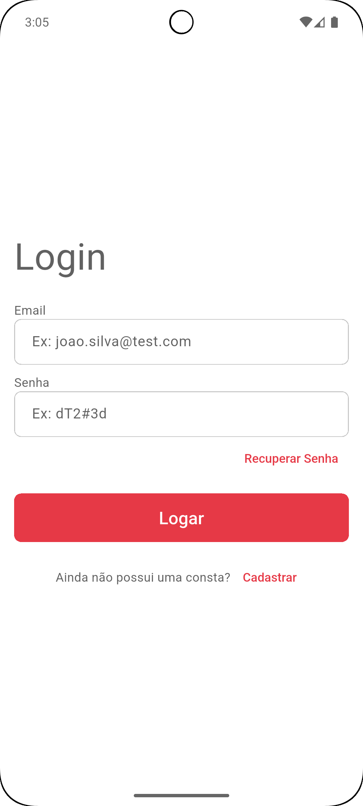
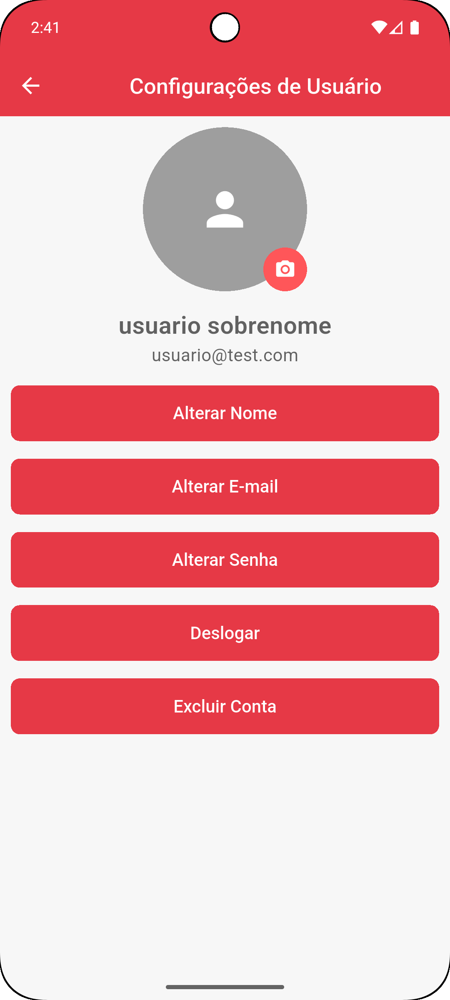
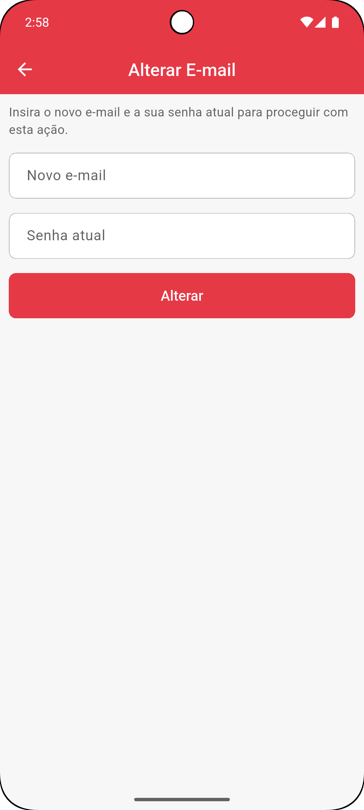
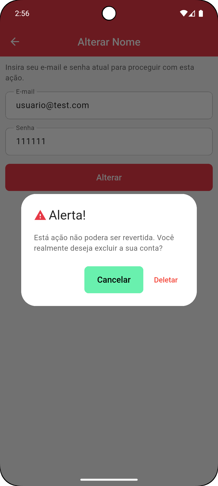

# Gestão de Usuários com Flutter + Riverpod

Aplicativo/Feature Flutter para **gestão de usuários** utilizando **Riverpod** como gerenciador de estado.  
Ideal para projetos que precisam de cadastro, login, listagem, edição e exclusão de usuários com arquitetura limpa e escalável.

> **Nota importante**: O objetivo não é usar este projeto como um app por si só, mas sim adiciona-lo como feature em um outro app que nececite de gestão de usuarios.

## 📸 Screenshots

<table>
<thead>
    <tr>
      <th>Login</th>
      <th>Configurações</th>
      <th>Alterar E-mail</th>
      <th>Deletar Conta</th>
    </tr>
  </thead>
  <tr>
    <td></td>
    <td></td>
    <td></td>
    <td></td>
  </tr>
</table>


## Funcionalidades Implementadas (ou em andamento)

- Cadastro de novos usuários
- Login / autenticação
- Listagem de usuários cadastrados
- Visualização de detalhes de usuário
- Edição e exclusão de usuários
- Gerenciamento de estado reativo com Riverpod
- ( ) Integração com Firebase Auth / Firestore / Storage
- ( ) Busca e filtros na lista de usuários
- ( ) Tratamento de erros e loading states
- ( ) Tema claro/escuro (opcional)

## Tecnologias Utilizadas

- **Flutter** 3.x (Dart)
- **Riverpod** ^2.x (gerenciamento de estado reativo e limpo)
- **flutter_riverpod** / **hooks_riverpod**
- **Firebase** (provável – autenticação e/ou banco)  
- **Material 3** Design
- Arquitetura sugerida: Camadas / Features / Clean Architecture light

## Estrutura de Pastas (sugestão atual ou futura)

```
lib/
├── core/                  # configurações globais, temas, rotas, exceções
├── features/
│   ├── auth/              # login, cadastro, recuperação de senha
│   ├── users/             # listagem, detalhes, criação/edição de usuários
│   └── ...
├── models/                # modelos de dados (User, etc)
├── providers/             # todos os providers Riverpod
├── repositories/          # abstrações de dados (local / remoto)
├── services/              # serviços (api, storage, auth)
├── widgets/               # componentes reutilizáveis
└── main.dart
```

## Como Executar o Projeto

1. Clone o repositório

```bash
git clone https://github.com/valdomiro22/gestao_usuario_flutter_riverpod.git
cd gestao_usuario_flutter_riverpod
```

1. Instale as dependências

```bash
flutter pub get
```

1. Configure o Firebase (se estiver usando)

- Adicione o `google-services.json` (Android) e `GoogleService-Info.plist` (iOS)
- Ou crie seu próprio backend

1. Execute o app

```bash
flutter run
# ou com um dispositivo específico
flutter run -d chrome    # web
flutter run -d windows
```

## Principais Providers (exemplo esperado)

```dart
final authRepositoryProvider = Provider<AuthRepository>((ref) => ...);
final userRepositoryProvider = Provider<UserRepository>((ref) => ...);

final authStateProvider = StateNotifierProvider<AuthNotifier, AuthState>((ref) => ...);
final usersProvider = FutureProvider<List<User>>((ref) async => ...);
final selectedUserProvider = StateProvider<User?>((ref) => null);
```

## Contribuindo

Contribuições são bem-vindas!  
Sinta-se à vontade para abrir **issues** ou enviar **pull requests**.

1. Fork o projeto
2. Crie sua feature branch (`git checkout -b feature/nome-da-feature`)
3. Commit suas mudanças (`git commit -m 'feat: adiciona cadastro com validação'`)
4. Push para a branch (`git push origin feature/nome-da-feature`)
5. Abra um Pull Request

## Licença

[MIT License](LICENSE) – fique à vontade para usar, modificar e distribuir.

---

Feito por [valdomiro22](https://github.com/valdomiro22)